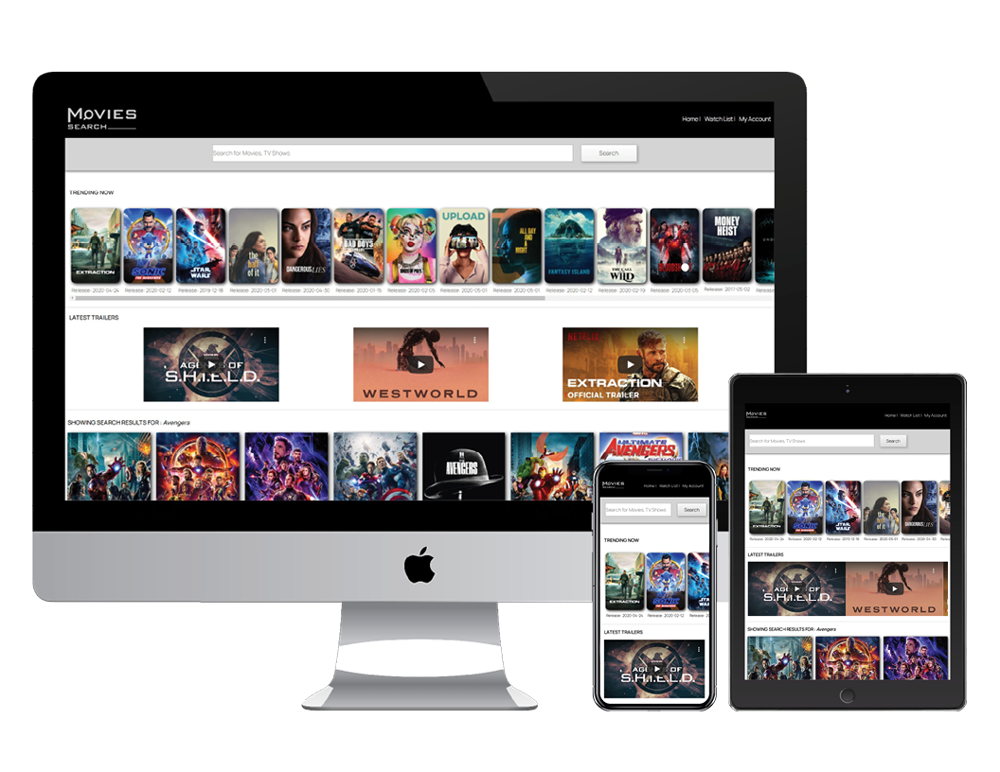
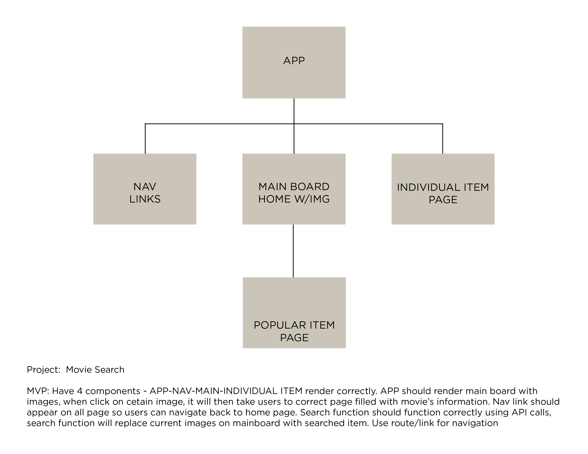

## About The Project

[Movies Search](https://tk-movies-search.herokuapp.com/) is a singple page application (SPA) built using React, it allows users to search for movies, tv shows, documentaries and many more.

## Movies Search



## User Stories

Everybody loves good movies and TV shows. However, be able to find a good movie or a TV show is challenging because there are too many out there, and we probably don't want to spend hours looking for something to watch then turns out to be mediocre at best. With Movies Search, users can search for movies and TV shows with a click of a button and the results are tailored to be as simple as possible. A title, users' rating and quick summary/overview of the content. What needs to be noted here is that the results and users rating are coming from trusted source (TMDB), so the reviews are genuine, came from viewers and not from critics. Users can also add/save the movies or TV shows in their watch list so they can access it later.

## Planning and Wireframing

I started the project with simple planning of how should I use React in a efficient way. Thinking about how many components should the website have, how they are linked together, how the navigation works, how it should present itself to the user when they first open the web. Then, I put those thinking into a simple presentation of component hierarchy.

### MVP

The website will have a minimum of four React components:
App component, Navigation component, Mainpage component and Individual Page. The App component should render Navigation and Mainpage where Mainpage is the container of images. The search results will be rendered and display on Mainpage. When click on an item, it should take users to the correct page display relevant information about the clicked item. Navigation should display on every page so users can navigate back to the home page.



When I had a solid idea of those components, I created a simple wireframe showing my idea of how the contents should appear on the main page, then follow that wireframe to structure my website's contents using React. This is just a basic layout and as I progress through the project, I'll adjust and add more components to accommodate users need


## Technology Used

HTML5 - semantic structure. <br>
CSS - grid, styling and micro interactions. <br>
React - React Hooks, Link, Route and components for virtual DOM manipulation, event listeners and event handlers, first class functions, call back functions. <br>
Git - Branches, save and commit changes to repo. <br>
GitHub- Updated from local repo and push to online repo. <br>
GitHub Pages- Hosting the app and its component for local installation if wanted. <br>
Heroku - Online hosting of the website <br>
Adobe CC/Sketch - To create logo and wireframe for the project. <br>
TBDM - Data and source for search's contents

## Installations and Instructions

No installation needed for this website/app. [Movies Search](https://tk-movies-search.herokuapp.com/) is hosted on heroku and should be usable via this [link](https://tk-movies-search.herokuapp.com/).

## Challenges and Overcome Obstacles

When I started the project I was new to React, the idea of using components to manipulate DOM was really new to me. Then I have to think about which should I use? function component, class component or hooks? how do I manage states and make sure that each component render and function correctly.

After finishing my first component and had it rendered correctly on the page, I felt more confident. I started to create more components and felt lost about how to connect them all together. Utilized Link and Route of React, I was able to connect component dynamically making navigation and interaction more fluid.

One of the challenges that I ran into is contents not showing correctly due to the delay of API calls, also results getting back from API calls are massive. So I have to handle contents/results in such a way that it only shows part of the result. Which bring me into the idea of splitting results into smaller pieces and implement function that allows users to view more results if they want.

This idea bring out another set of challenges where I have to create condition to render only parts of the results and display them on main page, and how to handle the rendering if the API calls are delayed. Condition render was the solution and I was able to implement it into the website and have results rendered correctly. I overcame these obstacles by breaking down problem to smaller pieces, do some researches, watch tutorials and review labs/works. Trial and error, go back and try different way, and ultimately solving the problem.

## Code Sample

Below is the code that I used for condition render to display search results component. It allowed users to toggle more/less results show on page.

```javascript
function SearchResults(props) {
	const { datas, moreItem, getMoreItem } = props;
	let itemToReturn;
	// return data from api call and display only first 10 items
	if (moreItem === false) {
		itemToReturn = (
			<div className='main-gallery'>
				{datas.slice(0, 10).map((data) => {
					if (data.poster_path === undefined) {
						data.poster_path = data.profile_path;
					}
					return (
						<div className='single-board' key={data.id}>
							<Link to={'/search/' + parseInt(data.id)}>
								</img>
								<h3>{data.original_title || data.name}</h3>
								<p className='year-info'>
									Release: {data.release_date || data.first_air_date}
								</p>
							</Link>
						</div>
					);
				})}
			</div>
		);
		// if user click on show more items, the data from api call will set to all items return from the call
	} else if (moreItem === true) {
		itemToReturn = (...'rest of code');
}
export default SearchResults;
```

### Silver, Gold and Platinum Goal

The website is currently at silver goal with lots of component, far from my initial MVP. My next goal is to implement filters function that allows users to filter the results according to their need. Ultimately, my platinum goal is to allow user to view more contents than just picture and overview, perhaps trailers and short clips, also allow users to create an account and access to their saved contents, post review etc.

Thank you for reading!
